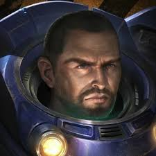
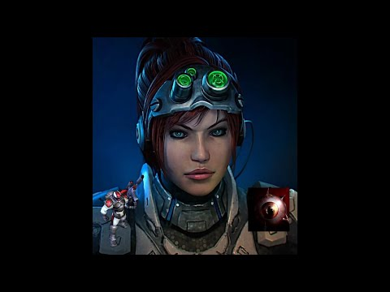
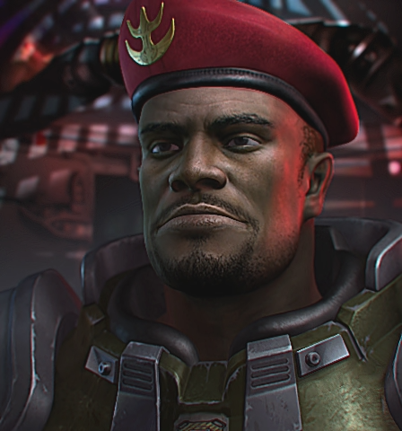
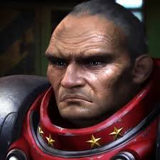
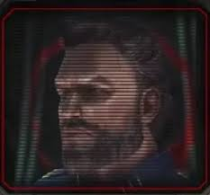
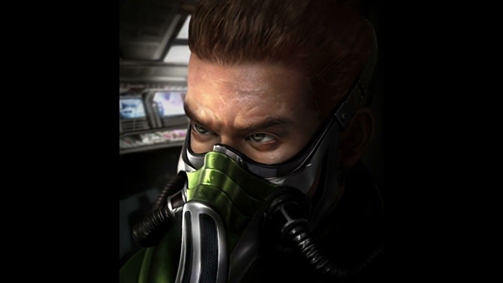
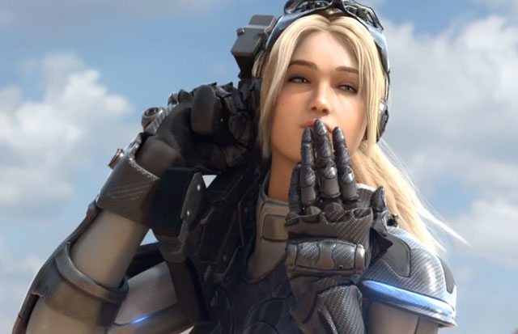
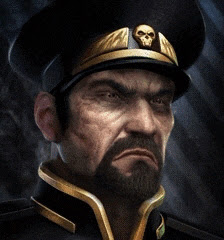

# 🛸 수상한 배틀크루져 (Suspicious Battlecruiser)

‘수상한 배틀크루져’는 스타크래프트 세계관 속 등장인물들이 감염된 테란을 찾아내는 **우주선판 마피아 게임**입니다. LLM을 활용한 심리전과 추리가 결합된 싱글플레이 추리 시뮬레이션이며, 유저 1명과 LLM 캐릭터 8명이 게임을 진행합니다.

## 🎮 게임 개요

- 배틀크루져 내부에서 저그로 부터 감염된 테란이 선량한 테란들 사이에 숨어 있습니다.
- 각 인물은 LLM 기반의 성격과 말투, 감정 상태, 추리 논리를 가지고 발언합니다.
- 플레이어는 각자의 대화, 단서, 감정 흐름을 기반으로 감염자를 추리해 매일 한 명을 우주 밖으로 추방하게 됩니다.
- 플레이어의 선택에 따라 테란이 승리하거나, 감염자가 최종 생존하여 저그가 승리하게 됩니다.

## 🧑‍🚀 등장인물 (총 8명)

| 짐 레이너 | 사라 케리건 | 사미르 듀란 | 에드먼드 듀크 | 아크튜러스 맹스크 | 톰 카잔스키 | 노바 테라 | 알렉세이 스투코프 |
|:---------:|:-----------:|:------------:|:--------------:|:-----------------:|:-------------:|:----------:|:-------------------:|
|  |  |  |  |  |  |  |  |


## ⚙️ 설치 및 실행 환경

- **Python**: 3.9 이상
- **LLM**: Ollama 설치 후 `EEVE-Korean-10.8B` 실행 필요
- **권장 실행 환경**: 터미널 또는 VS Code

```bash
pip install ollama
ollama run EEVE-Korean-10.8B
```


## 💻:게임 로직
1. 초기화 및 역할 부여
2. Day1 자기소개 → 몰입 유도
3. 매일 단서 랜덤으로 자동 생성 + 진술 + 투표
4. 의심 점수 누적 및 감정 변화 반영
5. 추방 및 승패 판단
6. 게임 종료 후 분석 리포
